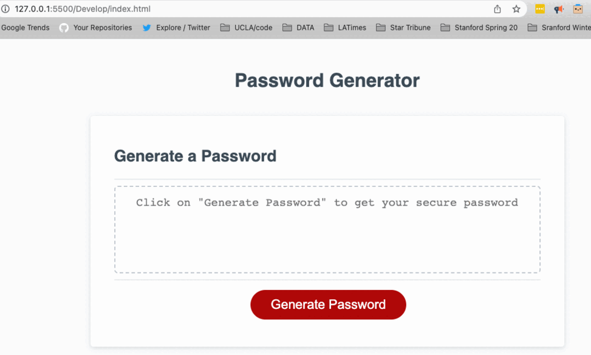

# Password-generator

> Salma's password generator

## Description

An application that helps users generate a random password. After clicking on the "Generate Password" button— follow the prompts to generate a random password.

## Table of Contents (Optional)

- [Installation](#installation)
- [Usage](#usage)
- [Credits](#credits)
- [License](#license)

## Installation

Go to [Password generator app](https://salmaloum.github.io/password-generator/) and follow the prompts.

## Usage

Click on the "Generate Password" button to get through the prompts as shown below:

- [Salma Loum](https://github.com/SalmaLoum)
- [UCLA Extension Bootcamp](https://www.uclaextension.edu/?gclid=Cj0KCQiAgribBhDkARIsAASA5btdbwAz8x25r3b1deoRNIGxfkPFL11rAQMuCgQ7HYiqBH8CLr9CgLoaAktlEALw_wcB&gclsrc=aw.ds)
- [Gif generator ezgif](https://ezgif.com/)

## License

Please refer to the LICENSE in the repo.

---
